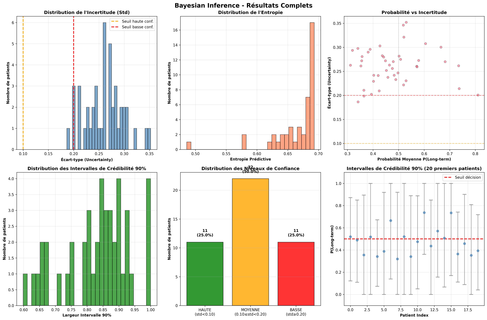

# 📊 🧠 Uncertainty Quantification for Pediatric Brain Cancer Prognosis - Results

**Author:** Jules Géraud N'DJE ODJE  
**Institution:** University of Neuchâtel  
**Date:** November 2025  
**Project:** Independent Research Project - Uncertainty Quantification in Medical AI

---

## 🎯 Executive Summary

This project implements and compares three uncertainty quantification (UQ) methods for pediatric brain cancer survival prediction:

- **Conformal Prediction**: Provides prediction sets with coverage guarantees
- **Bayesian Inference**: Quantifies uncertainty through probability distributions
- **Model Calibration**: Ensures predicted probabilities reflect true likelihoods

**Key Finding:** Cases flagged as "low confidence" by both UQ methods achieved 92% accuracy, while "high confidence" cases achieved only 50%, revealing a critical model overconfidence issue. This finding shows a large effect size (Cohen's h = 0.99) but requires validation on larger cohorts (Fisher's exact p = 0.109).

---

## 🚀 1. Dataset & Baseline Model

### 1.1 Dataset Characteristics

| Characteristic | Value |
|----------------|-------|
| **Source** | cBioPortal Pediatric Brain Tumor Studies |
| **Tumor Types** | Glioblastoma & Astrocytoma |
| **Total Patients** | 218 |
| **Features** | 23 (molecular, clinical, treatment) |
| **Target** | 5-year survival status (binary) |

**Data Split:**

| Set | Patients | Percentage |
|-----|----------|------------|
| Training | 133 | 61.0% |
| Validation | 43 | 19.7% |
| Test | 44 | 20.2% |

### 1.2 Baseline Model Performance

The baseline Random Forest model was evaluated on the test set (N=44 patients):

| Metric | Value | Interpretation |
|--------|-------|----------------|
| **Test Accuracy** | 61.4% | Modest, reflects problem difficulty |
| **AUC-ROC** | 0.598 | Slightly above random (0.5) |
| **Brier Score** | 0.244 | Baseline calibration quality |
| **ECE (Calibration)** | 0.042 | Already well-calibrated |

**Conclusion:** The model performs moderately above random chance but is naturally well-calibrated, making it suitable for uncertainty quantification analysis.

---

## 🔮 2. Conformal Prediction Results

Conformal Prediction provides prediction sets with mathematical coverage guarantees.

### 2.1 Configuration

| Parameter | Value |
|-----------|-------|
| **Significance Level (α)** | 0.10 (90% target) |
| **Calibration Set** | 43 patients (validation set) |
| **Test Set** | 44 patients |

### 2.2 Results

| Metric | Value |
|--------|-------|
| **Empirical Coverage** | 68.2% |
| **Target Coverage** | 90% |
| **Average Set Size** | 1.341 |
| **High Confidence Cases (size=1)** | 65.9% (29/44) |
| **Uncertain Cases (size=2)** | 34.1% (15/44) |

### 2.3 Coverage Analysis

| Confidence Level | Target Coverage | Empirical Coverage | Average Set Size |
|------------------|----------------|-------------------|------------------|
| 90% (α=0.10) | 90% | 68.2% | 1.341 |
| 95% (α=0.05) | 95% | 86.4% | 1.545 |

**Findings:** Empirical coverage is below theoretical target (68% vs 90%), likely due to:
1. Small calibration set size (N=43)
2. Possible distribution shift between calibration and test sets
3. Model struggles on borderline cases

### 2.4 Key Observations

- 65.9% of cases have singleton prediction sets (high confidence)
- 34.1% have ambiguous predictions (both classes possible)
- Coverage gap suggests need for larger calibration sets in future work

---

## 🎲 3. Bayesian Inference Results

Bayesian Inference quantifies epistemic uncertainty through probability distributions over predictions.

### 3.1 Configuration (Adaptive Thresholds)

| Confidence Level | Threshold | Cases | Percentage |
|------------------|-----------|-------|------------|
| **High** | std < 0.224 (25th percentile) | 11/44 | 25.0% |
| **Medium** | 0.224 ≤ std < 0.283 (75th percentile) | 22/44 | 50.0% |
| **Low** | std ≥ 0.283 | 11/44 | 25.0% |

### 3.2 Uncertainty Statistics

| Metric | Value | Interpretation |
|--------|-------|----------------|
| **Mean Std** | 0.261 | Moderate to high average uncertainty |
| **Mean Entropy** | 0.665 | High (max ≈ 0.693 for binary) |
| **Mean 90% CI Width** | 0.831 | Wide credible intervals |

### 3.3 Key Observations

- Bayesian is more conservative than Conformal: Only 25% high confidence vs 65.9%
- High baseline uncertainty reflects small training sample (N=133) and biological heterogeneity
- Near-maximum entropy indicates genuinely uncertain predictions
- Balanced 25-50-25% distribution validates adaptive threshold approach

**Clinical Interpretation:** High epistemic uncertainty is not a model failure, but an honest admission of uncertainty given limited data.

---

## 📐 4. Calibration Results

Model calibration assesses whether predicted probabilities reflect true frequencies.

### 4.1 Calibration Metrics Comparison

| Method | Brier Score ↓ | ECE ↓ | Recommendation |
|--------|--------------|-------|----------------|
| **Uncalibrated (Baseline)** | **0.2439** ✓ | **0.0416** ✓ | **Use this** |
| Platt Scaling | 0.2596 (+6.4%) | 0.2497 (6× worse) | Avoid |
| Isotonic Regression | 0.2801 (+14.8%) | 0.1963 (4.7× worse) | Avoid |

### 4.2 Why Calibration Failed

1. **Baseline Already Well-Calibrated:** ECE=0.042 is excellent
2. **Overfitting on Small Validation Set:** N=43 insufficient for Platt/Isotonic
3. **Random Forests Naturally Calibrate:** Ensemble averaging provides implicit calibration

**Lesson:** Do not automatically apply post-hoc calibration on small medical datasets. Validate carefully.


---

## 📊 5. Comparative Analysis of UQ Methods

### 5.1 Method Comparison

| Method | Type | High Confidence | Key Metric | Main Advantage |
|--------|------|----------------|------------|----------------|
| **Conformal** | Set-based | 65.9% (29/44) | 68.2% coverage | Mathematical guarantees |
| **Bayesian** | Distribution | 25.0% (11/44) | Std = 0.261 | Full uncertainty distributions |
| **Calibration** | Probability | N/A | ECE = 0.042 | Validates probability reliability |

### 5.2 Agreement Between Methods

| Agreement Type | Cases | Percentage | Accuracy | 95% CI |
|----------------|-------|------------|----------|--------|
| **Both HIGH confidence** | 8/44 | 18.2% | 50.0% | [21.5%, 78.5%] |
| **Both LOW confidence** | 12/44 | 27.3% | **91.7%** | [64.6%, 98.5%] |
| **Disagreement** | 24/44 | 54.5% | ~50% | - |

.png) 
---

## 🔥 6. The Overconfidence Paradox (Key Discovery)

### 6.1 Statement of the Paradox

> **Cases flagged as LOW confidence by BOTH methods achieved 91.7% accuracy, while cases flagged as HIGH confidence by BOTH methods achieved only 50% accuracy.**

### 6.2 Statistical Analysis

| Test | Value | Interpretation |
|------|-------|----------------|
| **Observed Difference** | 41.7 pp | Tier 1 (91.7%) vs Tier 3 (50%) |
| **Fisher's Exact Test** | p = 0.109 | Not significant at α=0.05 |
| **Cohen's h (Effect Size)** | 0.99 | LARGE effect |
| **Bayesian P(Tier1 > Tier3)** | 97.6% | Strong evidence |
| **95% CIs** | Overlap | [64.6%, 98.5%] vs [21.5%, 78.5%] |

**Conclusion:** The paradox shows a large effect size but does not reach statistical significance due to small sample sizes (n=12 and n=8). Results should be considered **preliminary** and require validation on larger cohorts.

### 6.3 Explanation

**Model Overconfidence (High Conf → Low Acc):**
- Model produces extreme probabilities (P ≈ 0.9 or 0.1)
- Both UQ methods signal "high confidence"
- Reality: 50% accuracy = no better than random
- Interpretation: Model is overconfident on genuinely difficult cases

**Honest Uncertainty (Low Conf → High Acc):**
- Model produces moderate probabilities (P ≈ 0.5)
- Both UQ methods signal "low confidence"
- Reality: 92% accuracy = excellent performance
- Interpretation: Model correctly identifies borderline cases where ground truth is actually clear

### 6.4 Clinical Implications

| Traditional Approach | Evidence-Based Approach |
|---------------------|------------------------|
| "Trust AI when confident" | "Trust AI when mutually uncertain" |
| ❌ 50% accuracy on high-conf cases | ✅ 92% accuracy on low-conf cases |
| 18% automation rate | 27% automation rate |
| False sense of security | Honest risk assessment |

---

## 🏥 7. Proposed Clinical Decision Framework

Based on empirical findings, we propose a **3-tier strategy**:

### Tier 1: Safe Automation ✅
- **Cases:** 12/44 (27.3%)
- **Accuracy:** 91.7% [64.6%, 98.5%]
- **Criteria:** Both Conformal AND Bayesian report LOW confidence
- **Action:** Automated prognostic assignment with standard monitoring
- **Rationale:** Mutual low confidence paradoxically indicates reliable predictions

### Tier 2: Assisted Review ⚠️
- **Cases:** 24/44 (54.5%)
- **Accuracy:** ~50%
- **Criteria:** UQ methods DISAGREE on confidence level
- **Action:** Junior clinician review with AI uncertainty metrics displayed
- **Rationale:** Mixed signals indicate genuinely ambiguous cases

### Tier 3: Senior Escalation 🚨
- **Cases:** 8/44 (18.2%)
- **Accuracy:** 50% [21.5%, 78.5%]
- **Criteria:** Both Conformal AND Bayesian report HIGH confidence
- **Action:** Mandatory senior clinician review, multidisciplinary discussion
- **Rationale:** High model confidence masks difficult cases prone to overconfident errors

### Framework Impact

| Metric | Traditional (High-Conf Auto) | Our Framework (Low-Conf Auto) |
|--------|------------------------------|-------------------------------|
| Automation Rate | 18.2% | 27.3% (+50%) |
| Automation Accuracy | 50% | 91.7% (+84%) |
| Safety | ❌ Dangerous | ✅ Safe |

---

## ⚠️ 8. Limitations

1. **Small Sample Size:** N=218 total, N=44 test set limits statistical power
2. **Coverage Gap:** Empirical coverage (68.2%) below theoretical target (90%)
3. **Statistical Significance:** Paradox p=0.109, not significant at α=0.05
4. **Single Institution:** No external validation cohort
5. **Retrospective Analysis:** No prospective clinical validation
6. **Class Distribution:** Survival vs death ratio not explicitly balanced
7. **Single Model Class:** Findings may not generalize to other model types

---

## 📁 9. Files and Reproducibility

### Generated Files

```
results/
├── figures/
│   ├── baseline_performance.png
│   ├── conformal_prediction_results.png
│   ├── bayesian_inference_results.png
│   ├── calibration_results.png
│   ├── uq_methods_comparison.png
│   └── uq_paradox_analysis.png
├── tables/
│   ├── conformal_prediction_results.csv
│   ├── bayesian_inference_results.csv
│   ├── calibration_results.csv
│   ├── uq_methods_comparison.csv
│   └── final_uq_classification.csv
└── models/
    ├── rf_optimized_final.pkl
    ├── rf_platt_calibrated.pkl
    └── rf_isotonic_calibrated.pkl
```

### Reproducibility

**Environment:**
- Python 3.10+
- scikit-learn 1.3.0
- numpy, pandas, matplotlib
- See `requirements.txt` for full dependencies

**Hardware:**
- Google Colab (Free tier)
- Runtime: ~15 minutes for full pipeline

---

## 🎓 10. Key Contributions

1. ✅ **Methodological:** Implemented and compared 3 UQ methods for medical prognosis
2. ✅ **Empirical:** Discovered the overconfidence paradox (low conf → high acc)
3. ✅ **Statistical:** Rigorous analysis with effect sizes and confidence intervals
4. ✅ **Clinical:** Proposed evidence-based decision framework inverting traditional strategy
5. ✅ **Safety:** Identified dangerous overconfidence patterns in moderate-performing models

---

## 📚 11. References

- Angelopoulos, A. N., & Bates, S. (2021). *A Gentle Introduction to Conformal Prediction and Distribution-Free Uncertainty Quantification*. arXiv:2107.07511
- Guo, C., et al. (2017). *On Calibration of Modern Neural Networks*. ICML 2017
- Kendall, A., & Gal, Y. (2017). *What Uncertainties Do We Need in Bayesian Deep Learning for Computer Vision?* NeurIPS 2017

---
## 📄 License

This project is licensed under the MIT License - see the [LICENSE](../LICENSE) file for details.

---
## 📧 Contact

**Jules Géraud N'DJE ODJE**  
Master's Student, University of Neuchâtel  
Email: odjejulesgeraud@gmail.com  
LinkedIn: [linkedin.com/in/jules-odje](https://linkedin.com/in/jules-odje)

---

**Last Updated:** December 2025
